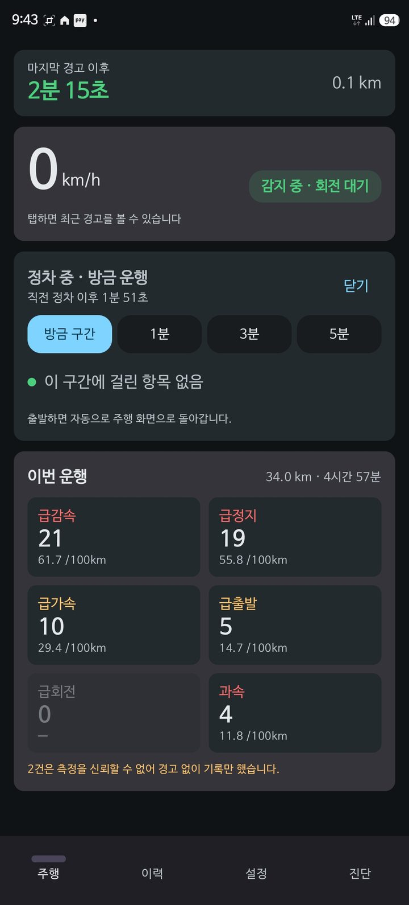
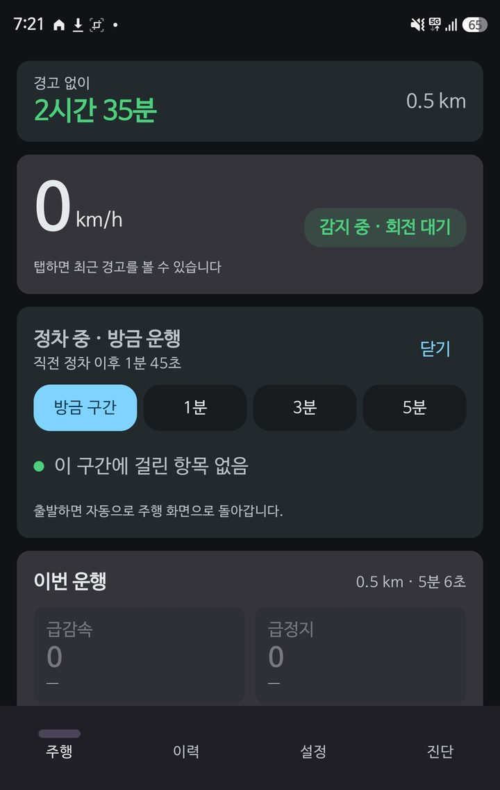
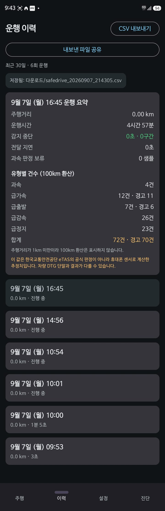
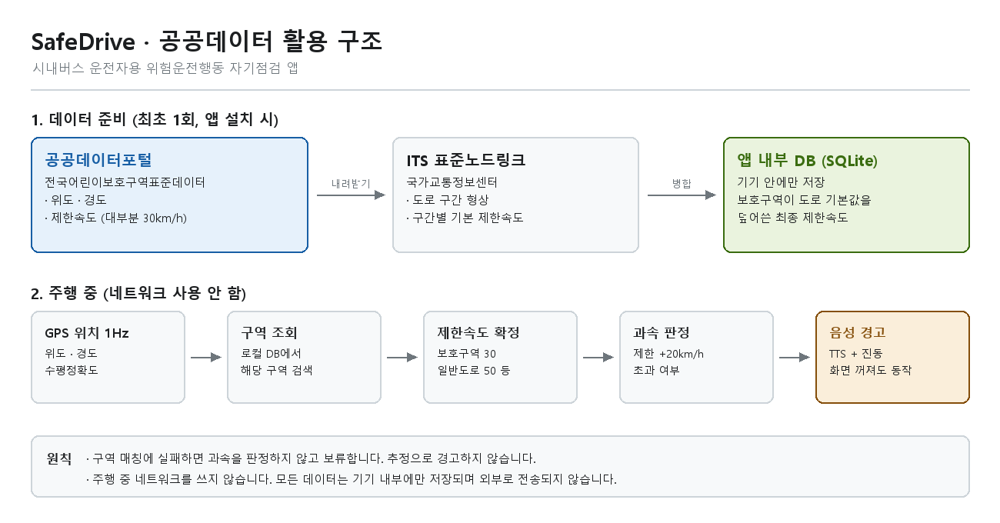

# SafeDrive — 시내버스 운전자용 위험운전행동 자기점검 앱

개인 휴대폰의 GPS와 관성센서만으로 위험운전행동을 추정해 음성으로 알려 주는
안드로이드 앱입니다. 차량 운행기록장치(DTG)를 쓰지 않습니다.

> **참고용 고지**
> 이 앱의 측정값과 판정은 한국교통안전공단 eTAS의 공식 판정이 아니라 휴대폰 센서로
> 계산한 **추정치**입니다. 차량 DTG 단말과 결과가 다를 수 있습니다.
> 운전자 개인의 자기점검 용도이며 회사의 감시·평가 도구가 아닙니다.
> 모든 데이터는 기기 내부에만 저장되고 외부로 전송되지 않습니다.

---

## 무엇을 하는 앱인가

시내버스 기사가 자기 운전 습관을 스스로 점검할 수 있게 만든 앱입니다.

- 주행 중 급감속·급정지·급가속·급출발·급좌우회전·급U턴·과속·장기과속을 판정
- 발생 시 **TTS 음성 + 짧은 진동**으로 알림 (화면이 꺼져 있어도 동작)
- 정류소에 정차하면 **직전 1~5분간 무엇이 걸렸는지** 자동으로 보여 줌
- 운행 종료 후 유형별 건수와 100km당 환산 건수를 요약
- 최근 30일 이력 조회와 CSV 내보내기

---

## 화면

| 주행 | 정차 리뷰 | 운행 이력 |
|---|---|---|
|  |  |  |

개발 과정과 실차 시험에서 찾아 고친 결함은 [docs/WORKLOG.md](docs/WORKLOG.md)에
정리해 두었습니다.

---

## 공공데이터 활용



### 전국어린이보호구역표준데이터 (공공데이터포털)

시내버스 운행구간에는 제한속도 30km/h인 어린이보호구역이 다수 포함됩니다.
일반 도로 제한속도만 적용하면 과속 판정이 부정확해지므로, 어린이보호구역의
위치와 제한속도를 반영합니다.

- 데이터를 앱 내부 데이터베이스에 저장
- 주행 중 GPS 위치가 구역 안이면 해당 구역 제한속도를 적용해 과속 판정
- **주행 중에는 네트워크를 사용하지 않고 로컬 조회만** 수행
  (터널·지하 구간에서 판정이 끊기지 않게 하고 장시간 운행 배터리 소모를 줄이기 위함)

### ITS 표준노드링크 (국가교통정보센터)

도로 구간별 기본 제한속도의 출처로 사용합니다. 어린이보호구역 데이터를 그 위에
덮어써서 최종 제한속도를 정합니다.

### 제한속도를 알 수 없을 때

구간 매칭에 실패하면 **과속 판정을 보류하고 기록만 남깁니다.**
추정으로 경고하지 않습니다. 틀린 제한속도로 경고하는 것보다 조용한 편이 낫다는 원칙입니다.

---

## 판정 기준

한국교통안전공단 위험운전행동 기준(버스)을 그대로 사용하며 임의로 조정하지 않습니다.

| 유형 | 속도 조건 | 기준 |
|---|---|---|
| 과속 | - | 도로 제한속도 +20km/h 초과 |
| 장기과속 | - | 위 상태 3분 이상 지속 |
| 급가속 | 6~10 km/h | 초당 8km/h 이상 가속 |
| 급가속 | 11~20 km/h | 초당 7km/h 이상 가속 |
| 급가속 | 21km/h 초과 | 초당 6km/h 이상 가속 |
| 급출발 | - | 5.0km/h 이하에서 출발, 초당 8km/h 이상 가속 |
| 급감속 | 30km/h 이하 | 초당 9km/h 이상 감속, 속도 6.0km/h 이상 |
| 급감속 | 50km/h 이하 | 초당 10km/h 이상 감속, 속도 6.0km/h 이상 |
| 급감속 | 50km/h 초과 | 초당 12km/h 이상 감속, 속도 6.0km/h 이상 |
| 급정지 | - | 초당 9km/h 이상 감속하여 5.0km/h 이하 도달 |
| 급좌우회전 | 25km/h 이상 | 3초 내 누적 회전각 60~160° |
| 급U턴 | 20km/h 이상 | 6초 내 누적 회전각 160~180° |

급진로변경·급앞지르기·연속운전은 판정하지 않습니다.

---

## 데이터 처리

- 저장 위치: **기기 내부 SQLite** (Room)
- 외부 서버 전송 경로 **없음**
- 보관 기간: 30일. 이후 자동 삭제
- CSV 내보내기는 사용자가 공유 시트에서 직접 목적지를 고를 때만 파일이 밖으로 나갑니다
- 클라우드 백업·기기 간 전송에서 앱 데이터를 제외 (`data_extraction_rules.xml`)

---

## 기술 개요

Kotlin 네이티브 안드로이드 단독. compileSdk 35 / minSdk 26 / targetSdk 35, JDK 17.

```
core/          판정 기준표, 실측이 필요한 모든 계수(근거 주석 포함), 벡터 연산
filter/        가변 dt 1차 IIR 저역통과, 이동 중앙값
sensor/        포그라운드 서비스 전용 IMU 수집기 (배칭 + 타임스탬프 정합)
align/         휴대폰 -> 차량 좌표계 정렬, 거치 이탈 감지
loc/           1Hz 위치 수집
fusion/        GPS 속도 + 가속도 적분 융합
judge/         8개 유형 판정, 정차 리뷰
gate/          4개 게이트 단일 상태 객체
alert/         TTS + 진동
speedlimit/    구간 제한속도 조회 (구현체 교체 가능한 인터페이스)
data/          Room 저장, 운행 요약, CSV
diag/          센서 끊김 기록, 진단 모드 원시값
service/       포그라운드 서비스
ui/            주행 / 이력 / 설정 / 진단
```

자세한 설계 배경과 실측이 필요한 계수 목록은 [docs/DEVELOPMENT.md](docs/DEVELOPMENT.md)에
있습니다.

### 핵심 설계 결정

**센서를 포그라운드 서비스 안에서만 등록** — API 28부터 백그라운드 앱은 연속보고형 센서
이벤트를 받지 못합니다. 서비스 밖에서 등록하면 화면이 꺼지는 순간 데이터가 끊깁니다.

**foregroundServiceType = location** — API 35에서 `dataSync` 등 일부 타입에 6시간
타임아웃이 도입됐습니다. `location`은 대상이 아니라 8시간 연속 운행에 안전합니다.

**wake-up 센서 우선 + 하드웨어 배칭** — non-wakeup 센서는 AP 서스펜드 구간에서 FIFO가
유실될 수 있습니다. `maxReportLatencyUs`로 묶어 받되, FIFO가 없는 기기에서는 무시된다는
사실을 진단 화면에 노출합니다.

**타임스탬프 정합** — 가속도/자이로/회전벡터가 서로 다른 배치로 도착하므로,
"가장 최근 값 붙이기"를 쓰면 최대 1초 어긋난 값이 짝지어집니다. 가속도계를 마스터 클록으로
두고 보조 센서를 이벤트 타임스탬프 기준으로 선형보간합니다.

**좌표계 정렬** — 정차 구간 가속도 평균으로 차량 상하축을 확정하고, 직진 가감속 구간의
수평 가속도를 GPS 속도 증감 부호로 정렬해 주성분(PCA)을 전방 축으로 삼습니다.

**경사로 보정** — 자기장을 쓰지 않는 `TYPE_GAME_ROTATION_VECTOR`로 매 시점의 중력 벡터를
산출해 제거합니다. 중력을 폰 좌표계에 고정된 값으로 가정하지 않으므로 경사로에서 중력
성분이 감속으로 오인되지 않습니다.

**판정 신호** — 기준표가 "초당 N km/h"로 정의돼 있으므로 **1초 창의 속도 변화량**을 씁니다.
IMU 순간 피크를 임계값에 직접 대면 노면 충격 하나에 오탐이 납니다.

### 4개 게이트

경고 발생 여부는 앱이 포그라운드인지와 무관합니다. 기준은 "지금 센서 데이터를 신뢰할 수
있는가"뿐입니다.

| 게이트 | 조건 |
|---|---|
| 좌표계 보정 | 차량 좌표계 정렬 완료 |
| GPS 품질 | 수평정확도가 임계값 이내 |
| 센서 연속성 | 직전 3초간 데이터 끊김 없음, 실측 20Hz 이상 |
| 거치 안정성 | 중력벡터 방향이 급변하지 않음 |

**하나라도 막히면 판정은 계속하되 경고를 내지 않고 이벤트만 기록합니다.**
그래야 한 번의 운행에서 "무엇이 몇 번 걸렸고 무엇이 왜 막혔는지"가 모두 남습니다.

---

## 빌드

```bash
./gradlew :app:assembleDebug
```

`local.properties`에 SDK 경로가 필요합니다. 윈도우는 `\` 대신 `/`를 씁니다.

```properties
sdk.dir=C:/Users/<user>/AppData/Local/Android/Sdk
```

---

## 현재 상태와 한계

실차 검증 전입니다. **임계값과 필터 계수는 모두 추정치**이며 `core/Constants.kt`
한 파일에 근거 주석과 함께 모여 있습니다.

- **배칭 1초와 경고 지연** — 배치 지연에 TTS 합성 지연이 더해져 급감속 경고가 2초 가까이
  늦을 수 있습니다. 실측 배터리 소모와 비교해 결정해야 합니다.
- **거치대 미세 회전** — 초기 정렬까지만 구현했고 완료 후 재추정은 없습니다.
- **저속 GPS 잡음** — 정지 상태에서도 도플러 속도가 3~11km/h로 관측됩니다. 속도정확도
  기반으로 억제하고 있으나 급출발·급정지 판정이 가장 취약합니다.
- **제조사 배터리 최적화** — 8시간 중 수집이 끊기는 가장 큰 원인. 온보딩에서 안내하고
  끊김 구간을 기록해 실제 손실을 측정합니다.

---

## 라이선스

MIT License. [LICENSE](LICENSE) 참고.

공공데이터의 이용 조건은 각 데이터 제공처의 라이선스를 따릅니다.
