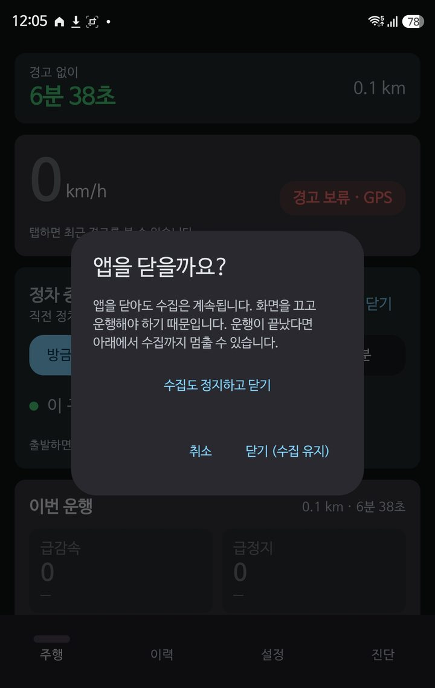
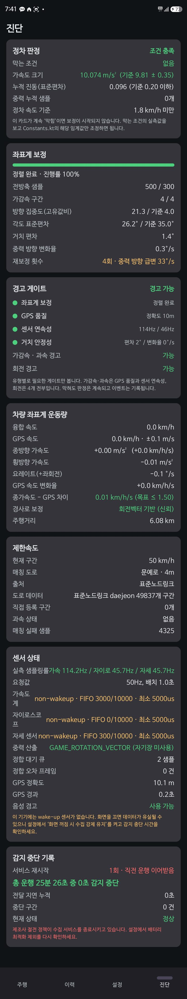
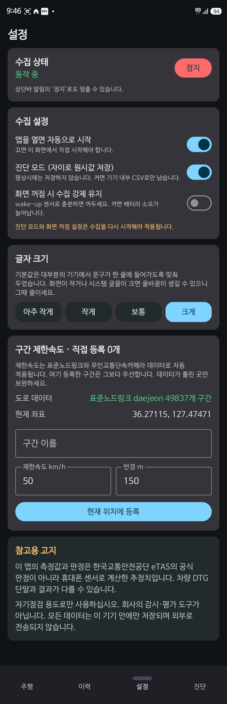

# SafeDrive 개발 기록

시내버스 기사용 위험운전행동 자기점검 앱을 만들면서 무엇을 했고, 실차 시험에서
무엇이 틀렸으며, 그것을 어떻게 찾아 고쳤는지의 기록입니다.

작성 기준: 2026-09-08 · 저장소 `github.com/sntpapa/safedrive-bus`

---

## 1. 무엇을 만들었나

개인 휴대폰의 GPS와 관성센서만으로 한국교통안전공단 위험운전행동 8개 유형을 판정하고
음성으로 알려 주는 안드로이드 앱입니다. 차량 DTG 단말을 쓰지 않습니다.

| 항목 | 내용 |
|---|---|
| 스택 | Kotlin 네이티브, Jetpack Compose |
| SDK | compileSdk 35 / minSdk 26 / targetSdk 35, JDK 17 |
| 저장 | Room + SQLite, 기기 내부에만. 외부 전송 경로 없음 |
| 규모 | Kotlin 40여 개 파일, APK 약 15.7MB (도로 데이터 10.6MB 포함) |

### 판정 대상

| 유형 | 속도 조건 | 기준 |
|---|---|---|
| 과속 | - | 제한속도 +20km/h 초과 |
| 장기과속 | - | 위 상태 3분 이상 |
| 급가속 | 6~10 / 11~20 / 21 초과 | 초당 8 / 7 / 6 km/h 이상 |
| 급출발 | - | 5.0km/h 이하에서 초당 8km/h 이상 |
| 급감속 | 30 / 50 이하 / 50 초과 | 초당 9 / 10 / 12 km/h 이상, 속도 6.0 이상 |
| 급정지 | - | 초당 9km/h 이상 감속해 5.0 이하 도달 |
| 급좌우회전 | 25km/h 이상 | 3초 내 누적 60~160° |
| 급U턴 | 20km/h 이상 | 6초 내 누적 160~180° |

급진로변경·급앞지르기·연속운전은 판정하지 않습니다.

---

## 2. 화면

| 주행 | 정차 리뷰 |
|---|---|
|  |  |

| 운행 이력 | 종료 확인 |
|---|---|
|  |  |

기사에게 보이는 `주행` 탭에는 기사가 이해하고 쓸 수 있는 것만 둡니다.
좌표계 보정 진행률, 센서 샘플링률, 게이트 상세 같은 개발자용 수치는 `진단` 탭으로
옮겼습니다. 다만 `감지 중` / `경고 보류` 상태 한 줄은 남겼습니다. 이게 없으면
조용한 이유가 운전을 잘해서인지 앱이 못 잡고 있어서인지 구분할 수 없습니다.

| 진단 | 설정 |
|---|---|
|  |  |

---

## 3. 핵심 설계 결정

### 판정 신호를 GPS 속도로 잡았다

기준표가 "초당 N km/h"로 정의돼 있으므로 **1초 창의 속도 변화량**을 1차 신호로 씁니다.
IMU 종가속도의 순간 피크는 1초 평균보다 훨씬 크게 나와(노면 요철 하나에 10 km/h/s 이상)
임계값에 직접 대면 과탐이 심합니다. IMU는 피크 기록과 경계값 보류 판단에만 씁니다.

이 선택 덕분에 가감속·과속 판정은 좌표계 정렬 없이도 동작합니다.

### 센서를 포그라운드 서비스 안에서만 등록

API 28부터 백그라운드 앱은 연속보고형 센서 이벤트를 받지 못합니다.
서비스 밖에서 등록하면 화면이 꺼지는 순간 데이터가 끊깁니다.

`foregroundServiceType`은 `location`입니다. API 35에서 `dataSync` 등 일부 타입에
6시간 타임아웃이 도입됐는데 `location`은 대상이 아니라 8시간 운행에 안전합니다.

### 타임스탬프 정합

가속도·자이로·회전벡터가 서로 다른 배치로 도착합니다. "가장 최근 값 붙이기"를 쓰면
배칭 1초 환경에서 최대 1초 어긋난 값이 짝지어집니다. 가속도계를 마스터 클록으로 두고
보조 센서를 이벤트 타임스탬프 기준으로 선형보간합니다.

### 4개 게이트, 그러나 유형별로 필요한 것만

| 게이트 | 조건 |
|---|---|
| 좌표계 보정 | 차량 좌표계 정렬 완료 |
| GPS 품질 | 수평정확도 15m 이내 |
| 센서 연속성 | 직전 3초간 끊김 없음, 실측 20Hz 이상 |
| 거치 안정성 | 중력벡터 방향이 급변하지 않음 |

가감속·과속은 GPS 속도만 쓰므로 `GPS 품질 + 센서 연속성`만 봅니다.
요레이트가 필요한 회전만 4개 전부를 요구합니다.

**게이트가 막혀도 판정은 계속하고 이벤트는 기록합니다.** 경고만 나가지 않습니다.
그래야 한 번의 운행에서 "무엇이 몇 번 걸렸고 무엇이 왜 막혔는지"가 모두 남습니다.

---

## 4. 제한속도 데이터 파이프라인

### 출처

| 데이터 | 역할 |
|---|---|
| ITS 표준노드링크 | 도로 구간별 기본 제한속도. 전국 링크 155만 개 |
| 전국무인교통단속카메라 | 경찰 단속 기준 속도. 노드링크 값을 보정 |
| 전국어린이보호구역 | 제한속도로 쓰지 않음. 판정 보류 플래그로만 사용 |

전국 데이터를 앱에 다 넣을 수 없어 운행 지역(대전+세종)만 잘라 SQLite로 만듭니다.
링크 49,837개, 세그먼트 324,342개, 약 10.6MB. 변환 도구는 `tools/`에 있습니다.

### 어린이보호구역을 제한속도로 쓰지 않은 이유

대전 영역(링크 35,447개, 보호구역 749곳)에서 실측한 결과입니다.

| 보호구역에서의 거리 | 링크 수 | `MAX_SPD`=30 | 40 이상 |
|---|---|---|---|
| 30m 이내 | 315 | 82.5% | 14.9% |
| 100m 이내 | 3,127 | 71.7% | 27.0% |
| 300m 이내 | 15,122 | 50.9% | 47.8% |
| 대전 전체 | 35,447 | 35.3% | — |

**노드링크가 이미 학교 인접 도로의 82.5%를 30km/h로 표시하고 있었습니다.**
반면 어린이보호구역 표준데이터에는 제한속도 컬럼도 구역 경계도 없고 학교 건물 좌표
한 점뿐입니다. 반경 300m로 덮어쓰면 47.8%의 링크가 실제로는 40 이상인데 30이 되어
학교 옆 간선도로가 전부 30이 됩니다.

그래서 제한속도는 노드링크만 쓰고, 보호구역은 "학교 50m 이내인데 제한속도 40 이상"인
링크(대전 194개)에 주의 플래그만 달아 과속 판정을 보류합니다.

### 단속카메라로 보정한 이유

대전 영역 카메라 2,168대를 노드링크와 대조한 결과 **1,296개 링크가 매칭됐고 그중
21.2%가 `MAX_SPD`와 달랐습니다.**

| 불일치 패턴 | 건수 | 결과 |
|---|---|---|
| 링크 50 → 단속 30 | 67 | 과속 **미탐** |
| 링크 30 → 단속 50 | 55 | 과속 **오탐** |
| 링크 60 → 단속 50 | 36 | 과속 미탐 |

양방향으로 틀리므로 카메라 값을 우선 적용합니다.

### 맵매칭

위경도 0.002° 격자 9칸에서 후보 세그먼트를 뽑고, GPS 진행방위와 링크 방위가 50° 넘게
다르면 버립니다(반대 차선·교차 도로 제거). 직전 링크에 4m 가산점을 주어 고가/지하차도를
구분합니다. 2순위가 8m 이내인데 제한속도가 다르면 어느 도로인지 확정할 수 없다고 보고
**과속 판정을 보류합니다.**

주행 중에는 네트워크를 쓰지 않습니다. 터널에서도 조회가 끊기지 않습니다.

---

## 5. 실차 시험에서 찾아 고친 결함

**이 절이 이 프로젝트에서 가장 중요한 부분입니다.** 전부 실제 운행 데이터로
확인한 것이며, 추측으로 고친 것은 없습니다.

### 5.1 정지 상태인데 속도가 3.8~11.2km/h로 표시

도플러 GNSS 속도는 정차 중에도 자기 속도정확도 수준의 잡음을 냅니다.
표시 문제가 아니라 **좌표계 보정의 "정차" 조건이 성립하지 않아 보정이 0%에서
영원히 멈추는** 문제였습니다.

`Location.getSpeedAccuracyMetersPerSecond()`를 써서 보고 속도가 자기 정확도보다
작으면 0으로 간주하도록 했습니다.

### 5.2 도로 데이터가 통째로 로드되지 않음

`assets.openFd()`는 압축되지 않은 파일에만 동작합니다. `.db`는 APK에서 압축되므로
버전 비교용 크기 조회가 항상 예외를 냈고, 제한속도 매칭이 전혀 되지 않았습니다.
진단 화면에 `도로 데이터: 없음`으로 나타났습니다. 버전 문자열 비교로 바꿨습니다.

### 5.3 전방축 추정이 노면 진동에 오염

2시간 운행 후에도 보정이 82%에서 멈췄습니다. 진단 화면 수치가 원인을 지목했습니다.

| 지표 | 실측 | 기준 |
|---|---|---|
| 전방축 샘플 | 1,081 | 300 |
| 가감속 구간 | 23 | 4 |
| **방향 집중도** | **2.8** | 4.0 |
| **각도 표준편차** | **55.9°** | 12° |

샘플과 구간은 3배 넘게 모였는데 방향이 모이지 않았습니다. 원인은 필터를 거치지 않은
원시 가속도를 쓴 것이었습니다. 노면 진동(±2~3 m/s²)이 실제 종방향 가속(0.8~2 m/s²)보다
컸습니다. 판정용과 같은 2Hz 저역통과를 적용했습니다.

또한 각도 표준편차 기준 12°는 `std = sqrt(-2 ln R)` 이라 평균벡터 크기 0.978을
요구하는 도달 불가능한 값이었습니다. 실측 없이 잡은 값이라 35°로 완화했습니다.

**결과: 방향 집중도 2.8 → 21.3, 각도 표준편차 55.9° → 26.2°, 보정 100% 완료.**

### 5.4 판정이 한 번도 실행되지 않음

판정 호출 전체를 "좌표계 정렬 완료" 조건으로 감쌌습니다. 보정이 0%면 판정이 한 번도
돌지 않아 CSV에 헤더만 남았습니다. 가감속·과속은 GPS 속도만 쓰므로 정렬과 무관하게
판정하도록 분리했습니다.

### 5.5 서비스 재시작 시 운행 기록 초기화

제조사 절전 정책이 서비스를 종료시키면 `START_STICKY`로 되살아나는데, 시작 시각과
누적 거리가 0으로 돌아가 "경고 없이 N분"이 실제보다 짧게 나왔습니다.
5초마다 생존 신호를 남겨 10분 이내 재시작이면 같은 운행으로 이어받습니다.

이어받기 구현 후에도 거리만 0이 되는 문제가 있었는데, 게시 루프의 생존 신호가
이어받기보다 먼저 실행되어 저장값을 0으로 덮어쓰는 경쟁 상태였습니다.

### 5.6 한 번의 제동이 2~3건으로 계상

```
21:24:08  급감속  27.8 km/h  -11.02
21:24:11  급감속   7.1 km/h  -13.54
21:24:12  급정지   0.0 km/h  -14.33
```

정류소 진입 제동 **한 번**입니다. 디바운스가 유형별이라 급감속과 급정지가 따로
세졌습니다. 디바운스를 계열 단위(감속 / 가속 / 회전)로 바꿨습니다.

### 5.7 물리적으로 불가능한 값이 경고로 나감

```
19:24:37  급출발  10.2 km/h
19:24:38  급정지   0.0 km/h   ← 1초 뒤
```

1초 만에 0→10→0은 버스로 불가능합니다. 저속 GNSS 잡음입니다.
가속 계열과 감속 계열이 3초 안에 연달아 나오면 나중 것을 보류합니다.

판정값 자체가 불가능한 경우도 있었습니다. 급출발 15.2와 24.3(1초에 0→24km/h,
6.7 m/s²)인데 대형버스 최대 가속은 1.0~1.5 m/s²입니다.
가속 10, 감속 22 km/h/s를 넘으면 측정 오류로 보고 보류합니다.

### 5.8 이면도로 오매칭으로 과속 오탐

과속 4건이 **전부 제한속도 10km/h 링크**에서 나왔습니다. 주차장 진출입로 같은 링크가
대전 영역에만 1,013개입니다. 16m 옆 이면도로에 매칭되면 30km/h로 달려도 과속이 됩니다.
제한속도 30 미만이면 과속 판정을 보류합니다. 어린이보호구역은 30이라 영향이 없습니다.

### 5.9 GPS가 튀는 구간이 게이트를 통과

```
22:09:25  66.1 km/h   정확도 15.2m   속도정확도 0.88
22:09:34  60.9 km/h   정확도 16.0m   속도정확도 1.07
22:09:38  24.7 km/h   정확도 14.4m   속도정확도 0.73
```

시내버스가 66km/h를 찍을 리 없습니다. 정상 이벤트는 정확도 3~10m에 몰려 있는데
이 구간만 14~16m였고 임계값 20m를 통과했습니다. 15m로 조였습니다.

그리고 **속도정확도를 처음으로 게이트에 넣었습니다.** 1초 차분의 표준편차는
`sqrt(2) × 속도정확도`인데, 1.07 m/s면 5.4 km/h/s로 급가속 임계값 6과 구분되지
않습니다. 판정값이 잡음의 2.5배가 안 되면 경고를 내지 않습니다.

### 5.10 판정값이 기록되지 않음

`최대가감속` 칸에 IMU 피크를 저장해 정렬 전에는 전부 0.00이었고, 급가속 이벤트에
-1.06(감속)이 찍히기도 했습니다. 이벤트가 얼마나 셌는지 알 수 없어 임계값 조정
근거가 없었습니다. 실제 판정에 쓴 값을 `판정값` 컬럼에 저장하고 GPS 속도정확도도
함께 남깁니다.

### 5.11 UI 결함

| 증상 | 원인 |
|---|---|
| 화면 상단이 상태바에 가려짐 | targetSdk 35의 edge-to-edge 강제 적용 |
| 밝은 테마에서 상태 글씨가 안 보임 | 어두운 배경용 색을 밝은 배경에 그대로 사용 |
| 항목명이 한 글자씩 세로로 쪼개짐 | 값에 폭을 주지 않아 항목명 칸이 0까지 눌림 |
| 리뷰 패널이 속도 위에 떠서 버튼 위치가 매번 바뀜 | 배치 순서 |
| 정지를 눌러도 즉시 다시 시작 | 자동 시작이 `serviceRunning=false`를 보고 재시작 |
| 뒤로가기로 앱이 바로 닫힘 | 확인 없음 |
| CSV가 앱 전용 폴더에 저장 | MediaStore 미사용 |

lint가 잡아낸 것도 있습니다. **`VIBRATE` 권한 누락** — 진동은 경고의 주 전달 수단인데
권한 없이 호출하고 있어, 소리가 안 들리는 상황에서 경고가 통째로 사라질 뻔했습니다.
**`resolveActivity()`** 는 API 30+ 패키지 가시성 제한으로 항상 null을 반환해
배터리 설정 버튼이 조용히 죽어 있었습니다.

---

## 6. 판정 신뢰도 — 실측 기반 평가

| 항목 | 신뢰도 | 근거 |
|---|---|---|
| 과속 | 상 (매칭 성공 시) | 마진 20km/h가 커서 GPS 오차에 둔감. 단속카메라로 보정 |
| 장기과속 | 중 · 미탐 편향 | 터널에서 게이트가 막히면 타이머 리셋 |
| 급감속 (50 이하/초과) | 상 | 중속에서 GPS 속도가 가장 정확 |
| 급감속 (30 이하) | 중상 | 신호는 튼튼하나 임계 9가 버스 상용 제동(7~11)과 겹쳐 자주 발생 |
| 급정지 | 중하 | 종단 저속 구간 GPS 잡음 |
| 급출발 | 하 | "5.0km/h 이하"가 잡음 구간과 정면으로 겹침 |
| 급가속 | 중하 | 기준 6~8 km/h/s가 버스 물리 성능(3.6~5.4)을 초과 |

**급가속이 자주 뜨면 운전이 거친 게 아니라 측정이 틀렸을 가능성이 큽니다.**
시내버스 0-50km/h가 12~18초라 평균 1.0 m/s², 저속 피크도 1.5 m/s² 수준입니다.

---

## 7. 현재 상태

| 단계 | 상태 |
|---|---|
| 센서 파이프라인, 좌표계 정렬, 게이트, 진단 | 완료 · 실차 검증 |
| 8개 유형 판정, TTS 경고, 오탐 억제 | 완료 · 실차 검증 |
| 제한속도(공공데이터), 과속 판정 | 완료 · 실차 검증 |
| 이벤트 저장, 운행 요약, CSV, 30일 이력 | 완료 · 실차 검증 |
| 정차 리뷰, 세션 이어받기, 접근성 | 완료 |

빌드 상태: `assembleDebug` 성공, `lintDebug` 오류 0건.

### 확인된 실차 동작

- 좌표계 보정 **100% 완료** (방향 집중도 21.3 / 기준 4.0)
- 도로 데이터 매칭 정상 (`문예로 · 4m · 제한 50`)
- 감지 중단 **0초**, 서비스 재시작 이어받기 정상
- 8개 유형 판정 및 음성 경고 동작

### 남은 과제

1. **급가속 임계값 처리** — 기준표 값(6~8 km/h/s)이 버스 물리 성능을 넘습니다.
   그대로 두고 기록만 할지, 속도정확도 기반 신뢰도 게이트를 더 조일지 미결정입니다.
2. **화면 끄고 8시간 운행 시험** — 시험 기기 세 대 모두 wake-up 센서가 없습니다.
   `설정 → 화면 꺼짐 시 수집 강제 유지`가 필요한지 실측으로 확정해야 합니다.
3. **배터리 소모 측정** — 배칭 지연 1초를 유지할지 낮출지는 이 측정 후에 결정합니다.
   낮추면 경고가 빨라지고 배터리를 잃습니다.
4. **운행 지역 확장** — 현재 DB는 위도 36.10~36.60, 경도 127.20~127.65입니다.
   노선이 공주·청주까지 가면 다시 뽑아야 합니다.
5. **거치대 미세 회전** — 초기 정렬 후 재추정이 없습니다. 흡착식 거치대가 주행 진동으로
   돌아가면 종/횡 축이 섞입니다.

---

## 8. 원칙

한 문장으로 줄이면 **"확실하지 않으면 경고하지 않는다"** 입니다.

- 제한속도 구간 매칭 실패 → 과속 판정 보류
- 맵매칭 후보가 모호 → 보류
- 판정값이 GPS 잡음 대비 부족 → 보류
- 차량 성능 초과 → 보류
- 어린이보호구역 근처인데 제한속도가 높음 → 보류
- 게이트 차단 → 경고 없이 기록만

**보류된 건도 사유와 함께 전부 저장됩니다.** 그래야 한 번의 운행이 다음 수정의
근거가 됩니다. 이 문서의 5절은 전부 그렇게 나온 것입니다.

그리고 이 앱의 판정은 한국교통안전공단 eTAS의 공식 판정이 아니라 휴대폰 센서로
계산한 추정치입니다. 자기점검 용도이며 회사의 감시·평가 도구가 아닙니다.
모든 데이터는 기기 안에만 저장되고 외부로 전송되지 않습니다.
